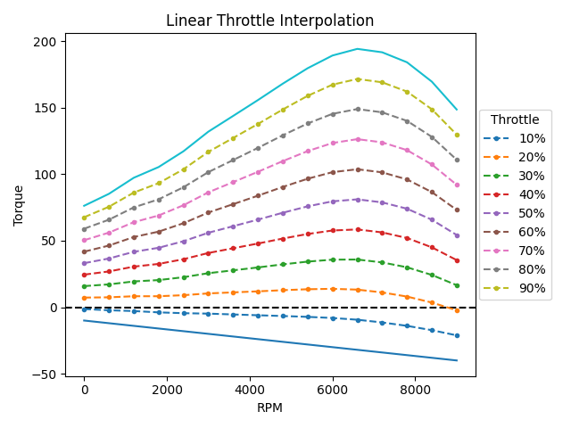
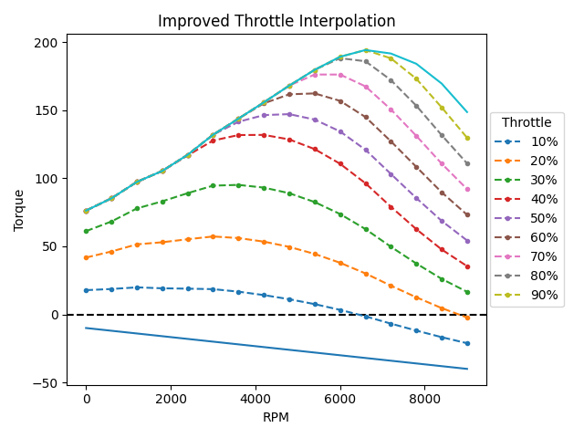

# Improved throttle interpolation

## Background
After being recommended a video by Niels Heusinkveld discussing the non-realistic torque interpolation used in many modern racing sims, I tried to write a quick script that generates a more realistic interpolation.

## Results
Many modern day sims seems to use a linear interpolation between a full throttle curve and a zero throttle curve, that simulates the engine inertia.

This results in throttle curves as seen in the following diagram:

Using a scaled smoothstep we are able to generate following torque curves:

The script uses a full throttle torque curve ripped from the RSS Protech P91 Mod for Assetto Corsa and a linear zero throttle curve.

## Usage and dependencies
This script can either be run standalone, this will create the diagram seen in Results.
Alternatively you can run the script in VSCode as a Jupyter Notebook, which will result in an interactive diagram.

The script uses matplotlib for plotting and ipywidgets for the interactive notebook-plot.

## Recources
- Original Video: https://youtu.be/0gW-cbSX3Uc
- Reference Torque curves: https://www.researchgate.net/figure/Predicted-Engine-output-torque-for-different-throttle-positions-and-engine-speeds_fig3_286637947
- Smoothstep: https://en.wikipedia.org/wiki/Smoothstep